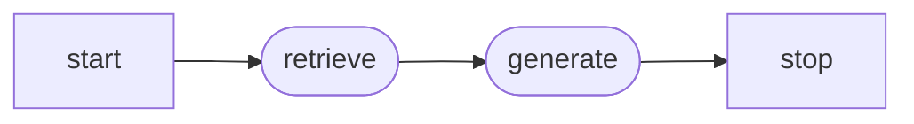

==langgraph is an **open source** orchestration framework designed to build robust, stateful, multiagent AI applications.==

very low-level, fine grain, agent orchestrator.

it has the ability to mix agentic and deterministic steps in the same graph allowing you to have steps within the workflow that are fully predictable and auditable.

## how I used it
used in [[corporate_rag]] to wire a minimal two node graph:

- `retrieve` → embeds the question, queries qdrant asking for at most 3 closest vectors, builds context (the text from these 3 close vectors that we will use to build an answer).
- `generate`: when generate runs, the state has the question (query) and the context from the search we got from the previous retrieve step. This step prompts ollama with that context and the question and explicitely states to only use the context returned by the vector database (to avoid hallucinations).

## Related

- [[notebooks/rag_stack_skeleton_exec.ipynb]]