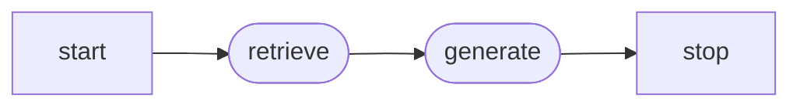

## Notebook

`notebooks/rag_stack_skeleton_exec.ipynb`

## what am I building?
a RAG to aid in costumer service for a hypothetical shipping company.

## why?
this was done as an experiment to understand core concepts around:
1. how to build a rag
2. what [[langgraph]] is
3. what [[langfuse]] is
4. what [[qdrant]] is

## what does our RAG look like?
from [[langgraph]] we know that our graph looks like: 

our RAG does the following:
- `retrieve` → embeds the question, queries qdrant asking for at most 3 closest vectors, builds context (the text from these 3 close vectors that we will use to build an answer).
- `generate`: when generate runs, the state has the question (query) and the context from the search we got from the previous retrieve step. This step prompts ollama with that context and the question and explicitely states to only use the context returned by the vector database (to avoid hallucinations).

### what exactly is the context?
the context in this case is the top 3 chunks qdrant returns as the closest to the embedded query.

the context is _not_:
- the whole document embedded. It is just the top 3 chunks, filtered by similarity for this one query.
-  fixed. Every time we call the retrieve node, the context changes since the embedded query sent to qdrant changes and thus the space in which it falls.
- the model's context window. 

## concepts

- [[LLM Agents]]
- [[RAG]]
- [[vector databases]]
- [[LLM Observability]]

